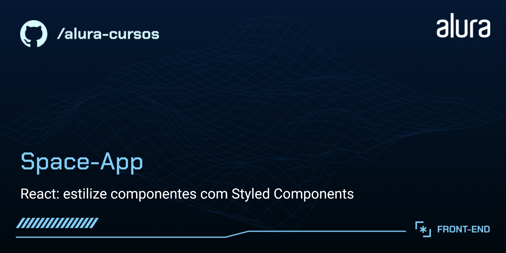

# "Space-App"

> Do curso da Alura:
React: estilize componentes com Styled Components e manipule arquivos estáticos

O Space-App é um aplicativo para visualização de fotos espaciais.

## 🔨 Funcionalidades do projeto

O aplicativo permite ao usuário a visualização, pesquisa e favoritação das imagens nele presentes.
As imagens selecionadas podem ser ampliadas através de zoom.
A pesquisa das fotos pode ser realizada por nome ou ainda por categorias.

## ✔️ Tecnologias utilizadas

As tecnologias utilizadas pra isso foram:

-  : construção do conteúdo da página
-  : estilização da página e responsividade
-  : interatividade da página
-  : desenvolvimento dos diversos componentes da página
-  : estrutura do projeto
-  : instalação e manutenção de dependências
-  : instalação e manutenção de dependências
-  : fonte do projeto UI / UX
-  : controle de versão
-  : repositório do código
-  : hospedagem do site
-  : IDE
-  : pesquisa de conteúdo
-  : pesquisa de conteúdo através de IA
-  : pesquisa de conteúdo através de IA
-  : pesquisa de conteúdo através de IA
-  : verificação e atualização de dependências
-  : web browser
-  : web browser
-  : web browser
